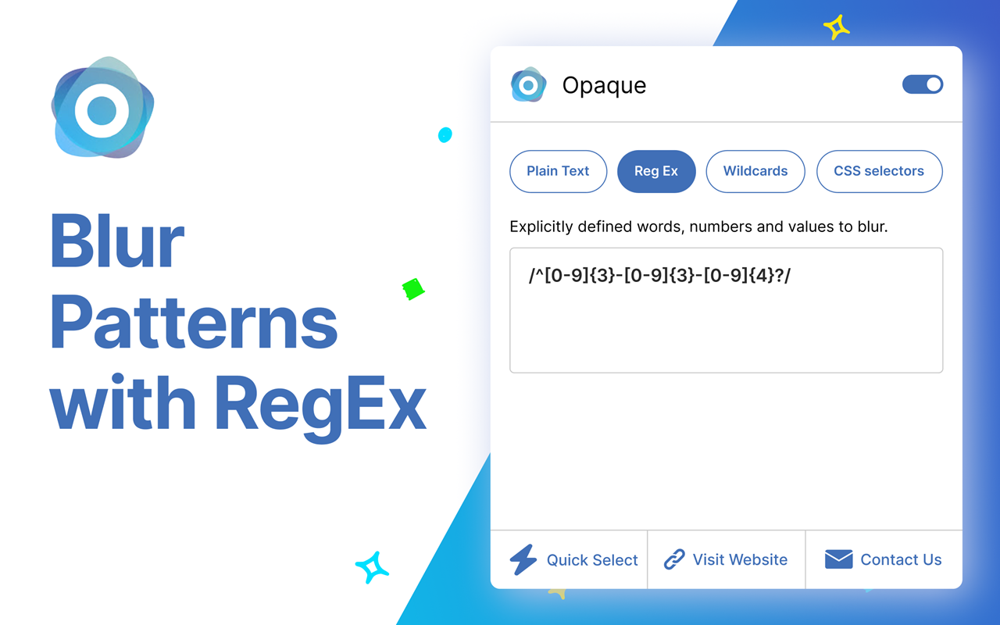
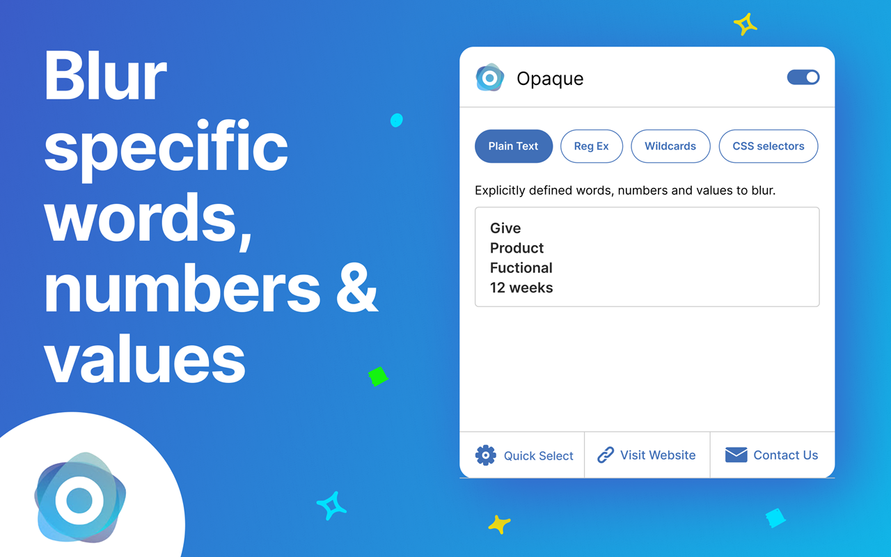
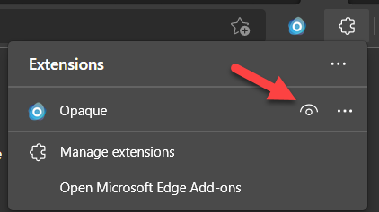

# Opaque Browser Extension
Chromium-based browser extension, supporting Microsoft Edge and Google Chrome.

Safely blur sensitive text and values. 

Broad set of options to blur text and values using explicit terms or pattern matching:

- Plain text
- RegEx!!!
- Wildcard
- CSS selectors

------

> **Opaque is the 1st browser extension to use RegEx for pattern matching.**
>
> **This opens the door to safe guard sensitive data while sharing your screen during a conference call or recording videos!**

------

Built-in Quick Select options

1. GUID
2. Domain Names
3. Emails

Great for screen sharing and screen captures!

If you have any issues or would like to request new features, please let us know - [Support and Feature Requests](https://github.com/OpaqueApp/ChromiumBrowserExtension/issues)

#### Screenshots

##### Main page of Opaque App 

Shows the switches used to enable blurring and pattern matching options.

##### Side Menu of Opaque App 

Shows the links to our website, contact, and version.

##### Example of using RegEx to Blur

Shows using RegEx to pattern match and blur text and values on example website.

##### Example of using Plain Text to Blur

Shows using Plain text to pattern match and blur text and values on example website.

##### Example of using Quick Selection with GUID to Blur

Shows using Quick Select with GUID to pattern match and blur GUID values.

#### Installation

##### Edge Extension Store

- Extension submitted 9/8/22
- Currently under review
- Will update with link to store listing when approved

##### Chrome Web Store

- Extension submitted 9/8/22
- Currently under review
- Will update with link to store listing when approved

##### Developer Mode

- Download "OpaqueAppExtension-LatestVersion.zip"
- Extract locally
- Open Edge or Chrome Extension settings
- Select Developer Mode
- Select "Load unpacked" button
- Navigate to where you extracted the zip archive
- Select the folder
- Select Extension button on menu bar
- Select eye icon to make Opaque App visible on menu bar

